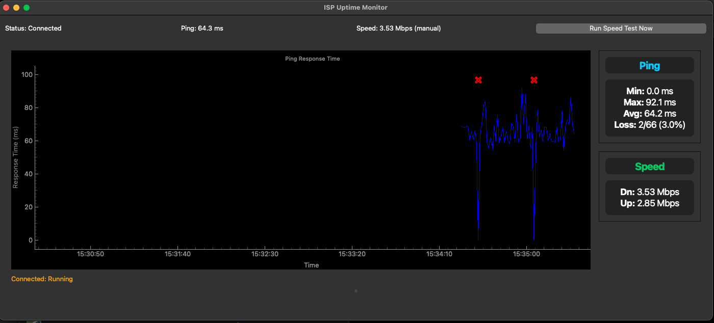

# ISP Uptime Monitoring

Real-time ISP performance monitoring dashboard built with Python and PyQt6.

## Features
- Real-time ping monitoring
- Speed testing
- DNS leak detection
- Packet loss tracking
- 5-minute scrolling ping window
- Min/max/avg ping metrics
- Download/upload speed metrics

## Dashboard View



*Dashboard showing ping response graph with packet loss markers (X), current metrics, and test results.*

## Project Structure

```
src/
  isp_monitor/
    __init__.py
    main.py         # Entry point, argument parsing
    dashboard.py    # PyQt6 GUI and dashboard logic
    monitor.py      # ISPMonitor: ping and speedtest logic
    workers.py      # QThread-based background workers
    utils.py        # Utility functions (e.g., time formatting)
    dns_leak.py     # DNS leak testing functionality
tests/
  ...
```

## Features in Detail

### DNS Leak Testing
- Tests if DNS requests route through configured DNS servers
- Identifies unexpected DNS servers in use
- Shows configured and detected DNS servers
- Useful for VPN DNS configuration verification

### Network Monitoring
- Continuous ping monitoring with statistics
- Packet loss detection
- Speed testing with download/upload measurements
- Real-time data visualization

## Setup

1. **Create and activate a virtual environment:**
   ```bash
   python3 -m venv venv
   source venv/bin/activate  # On Unix/macOS
   # or
   .\venv\Scripts\activate  # On Windows
   ```

2. **Install dependencies:**
   ```bash
   pip install -r requirements.txt
   ```

## Install with pip or pipx

Install from GitHub:

```bash
pip install git+https://github.com/josh-whitcomb/isp_monitor.git
```

Or with pipx:

```bash
pipx install git+https://github.com/josh-whitcomb/isp_monitor.git
```

Run:

```bash
isp-uptime-monitor
```

## Usage

Run the dashboard (if not using pipx):
```bash
python -m src.isp_monitor.main
```

Optional arguments:
- `--no-speedtest` : Do not run a speed test at startup

## Development
- Use `black` for code formatting
- Use `flake8` for linting
- Use `pytest` for testing

## Implementation Notes
- Network logic in `monitor.py`
- Threading in `workers.py`
- UI in `dashboard.py`
- DNS leak testing in `dns_leak.py`
- Ping monitoring pauses during speed tests 